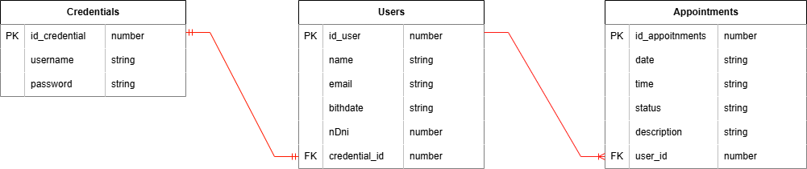

## Project planning

## User Stories
- as a guest user
    - Allow Registration
    - Enter the Home to view content
- as a user registered
    - be able to log in 
    - close session
    - make an appointment
        - choose date and time
        - customers hour: 9:00 to 17:00, available turn each 1 hour 
        - turns from the next day
    - cancel appointment
    - check my appointments reserved

## UX/UI
- footer with additional information
- menu slide 
    - contact channel
- Landing
    - welcome
- Home 
    - general information about the bussisnes
- User panel:
    - View appointments: date, time, description y status 
- Form
    - validation in current time   
    - limit appointments by date and time  

## Diagram enitity-relation
